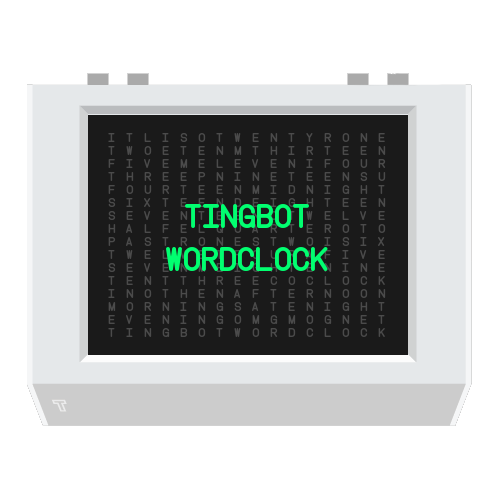

Use your Tingbot as a Wordclock.

You can grab the `.tingapp` from the [releases page](https://github.com/omgmog/tingbot-wordclock/releases) or built the `.tingapp` yourself using the instructions below.



## Building the `.tingapp` package

```
npm install .
gulp
```

Then open the created `.tingapp` in Tide and send it to your Tingbot